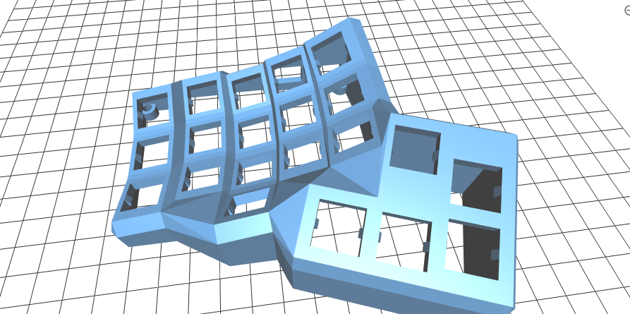

# Dactyl CC Mini

Work in Progress.

A smaller version of the [Dactly CC keyboard](https://github.com/mjohns/dactyl-cc) with the following changes (besides key removal):

* Thumb end key removed and alt and home key moved down.
* Thumb is moved in closer in the x direction.
* Entire height is shifted down to keep it as low profile as possible.



```
cd build
cmake ../src
make && ./dactyl
```

If you don't have cmake installed you can just run build/build_simple.sh but it is much slower especially for incremental compilations.
